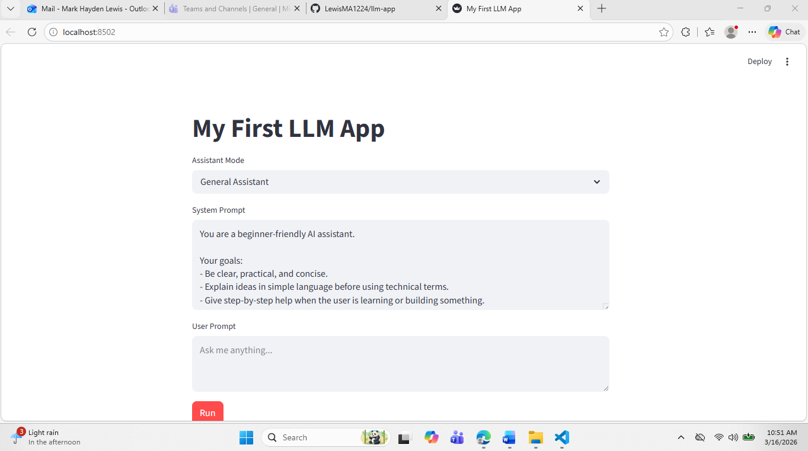

# Streamlit + OpenAI Chatbot

A simple beginner portfolio project that shows how to build a clean AI chatbot UI with Streamlit and connect it to the OpenAI API.

## Screenshot

Main app screen:

## Why This Project

- Keeps the scope small and clear
- Demonstrates prompt design with an editable system prompt
- Uses assistant modes to show product thinking
- Handles common API errors in a user-friendly way

## Features

- Streamlit web interface
- Assistant mode dropdown:
  - General Assistant
  - Interview Coach
  - Code Explainer
- Editable system prompt from prompts/system_prompt.txt
- OpenAI Responses API call with gpt-5-nano
- Clear error messages for missing keys, auth issues, rate limits, and network failures

## Project Structure

.
|- app.py
|- README.md
|- requirements.txt
|- images/
|  |- app-screenshot.png
|- prompts/
|  |- system_prompt.txt

## Quick Start

1. Clone the repository.
2. Create and activate a virtual environment.
3. Install dependencies with pip install -r requirements.txt.
4. Create a .env file in the project root:
   OPENAI_API_KEY=your_api_key_here
5. Run the app with streamlit run app.py.

## How It Works

1. Loads environment variables and a default system prompt.
2. Lets the user pick an assistant mode.
3. Combines base prompt and mode instruction.
4. Sends the user prompt to OpenAI.
5. Renders the model response in the app.

## Interview Talking Points

- Why a small project is easier to test and explain
- How prompt instructions shape assistant behavior
- Why clear error messages improve usability
- How to structure code cleanly without overengineering

## Next Small Improvement

Add a quick example prompt picker so first-time users can test the app in one click.

